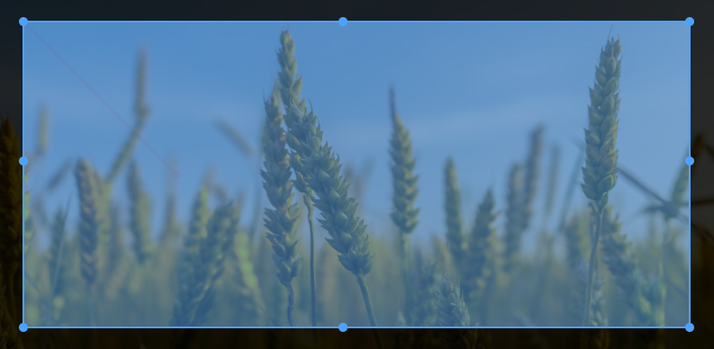

> A simple selection of area in JavaScript


 
 




## Table of contents

- [Main](#main)
- [Getting started](#getting-started)
- [Options](#options)
- [Methods](#methods)
- [Events](#events)
- [License](#license)

## Main

---
```text
dist/
├── garea.min.js    (UMD)
├── garea.common.js (CommonJS, default)
└── garea.esm.js    (ES Module)
```

## Getting started

---

### Installation
 
```shell
npm install garea.js
```
or
```shell
yarn add garea.js
```

In browser:

```html
<script src="garea.min.js"></script>
```

### Usage

#### Syntax

```js
new Core(idCanvas);
```

#### Example

```html
<div style="position: relative">
    
    <canvas id="crop" width="600" height="400"></canvas>
</div>
```

```css
#image {
    width: 600px;
    height: 400px;
    user-select: none;
    position: absolute;
}

#crop {
    z-index: 9;
    position: absolute;
}
```

With js example:
```js
import { Core as Manager } from 'garea.js';

const manager = new Manager('crop');
manager.addDraw('area');
const area = manager.getDraw('area');
area.onListener('onchange', points => {
    console.log(points);
});
manager.setEdit('area');
manager.create();
```

## Options

---

You may set garea options with `crop.addDraw(name, config)`.
If you want to change the global default options, You may use `draw.config = config`.

Exemple:
```js
const crop = new Core('crop');
crop.addDraw('area', {
    radius: 6,
    margin: 20,
    stroke: 5
});
```

### radius 

- Type: `Number`
- Default: `5`

Description: `Size of the points that will be created.`

### margin

- Type: `Number`
- Default: `30`

Description: `Starting margin of points if not entered.`

### stroke

- Type: `Number`
- Default: `30`

Description: `Size of the connecting line between the points.`

## Methods

---

## Methods for core

### addDraw(name, config): void

Add a new draw

- **name**
  - Type: `String`
- **config**
  - Type: `Object`

````js
const crop = new Core('crop');
crop.addDraw('area', {});
````

### getDraw(name): Draw

Get draw by name.

- **name**
    - Type: `String`

````js
const crop = new Core('crop');
crop.addDraw('area', {});
const area = crop.getDraw('area');
````

### removeDraw(name): void

Remove draw by name.

- **name**
    - Type: `String`

````js
const crop = new Core('crop');
crop.addDraw('area', {});
crop.removeDraw('area');
````

### setEdit(name): void

Set area for edit layer

- **name**
    - Type: `String`

````js
const crop = new Core('crop');
crop.addDraw('area', {});
crop.setEdit('area');
````

## Methods for draw

### getName(): string

Return name for area.

````js
const area = crop.getDraw('area');
area.getName(); // return 'area'
````

### setColor(key, value): Draw

Change color

- **key**:
    - Type: `String`'
    - Options:
        - `'area'`
        - `'points'`
        - `'stroke'`
        - `'background'`
    
- **value**
    - Type: `String`

````js
const area = crop.getDraw('area');
area.setColor('area', 'rgba(47, 175, 255, .5)');
````

### setConfig(key, value): Draw

Set config for area.

- **key**
    - Type: `Object`
    - Options:
        - `'radius'`
        - `'margin'`
        - `'stroke'`
    
- **value**
  - Type: `Number`

````js
const area = crop.getDraw('area');
area.setConfig('radius', 6);
````

### getPoints(): Array

Return points for area.

````js
const area = crop.getDraw('area');
area.getPoints(); // return [{ x, y }]
````

### setPoints(points): Draw

Set points for area;

- **config**
    - Type: `Array`

````js
const area = crop.getDraw('area');
area.setPoints([{ x, y }]);
````

## Events

---

### onListener(event, callback)

Listen to the actions of the area.

````js
const area = crop.getDraw('area');
area.onListener('onchange', () => {});
````

- **events**:
  - Type: `String`'
  - Options:
      - `'onchange'`: when the value of some of the points changes
      - `'onmousedown'`: when you click on one of the points
      - `'onmouseup'`: when you release the clicked point
      
## License

---

[MIT](https://opensource.org/licenses/MIT) © [Giovane Santos](https://giovanesantossilva.github.io/)
